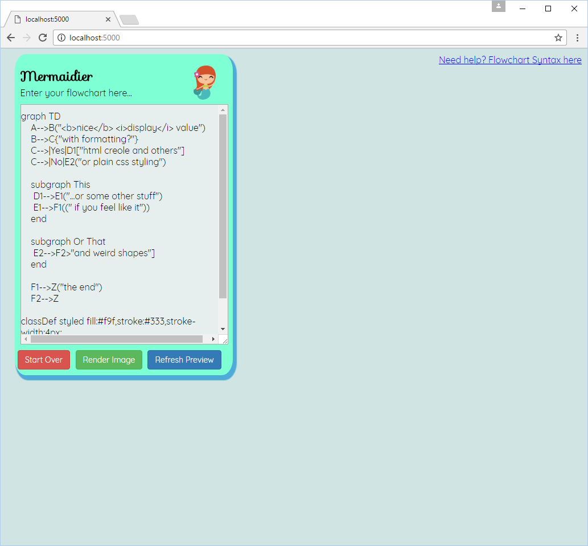
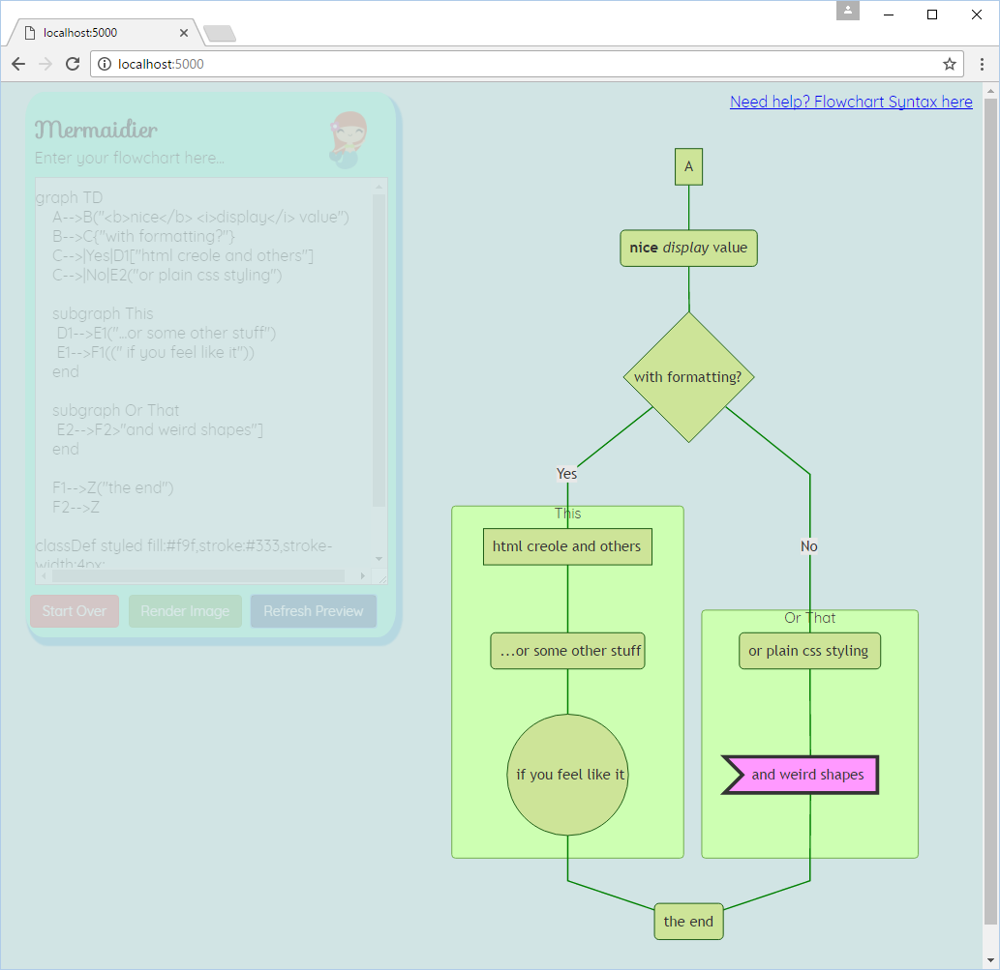

# Mermaider
An Asp.net core 1.1.1 (Mermaid)[https://github.com/knsv/mermaid] chart authoring page. It can provide 
on page previews in svg with limited diagnostics, or png images by server side rendering. 

It will have some library function to hold the charts and images so they can be referenced by other stuff, 
and a per-user library that can be used for work in progress. 

Chart entry

Chart Svg Render

### dev notes

I needed a learning project for some stuff, and something that could be used to perma-store 
charts and other images (without relying on some other service). 

Have fun with this, but please keep in mind I'm a bit of an idiot with javascript after having done 
predominantly server-side programs for the last several years. I get the idea, but its amazing to see 
the web tech is still as fragmented and jumbled as it was in the IE4/Netscape html tagsoup days.

This should be as easy to start as hitting F5 in VS 2017, but you may have to run the gulp tasks marked __seldom__
at least once. Taking the whole bootstrap package wrecks the generated svg previews, so the gulpfile 
compiles only the ones necessary.

I _really_ fucking hate Git version control. Right now, it wants me to commit changes to this readme and WIP to 
a branch I dont want to instead of just switching out the base. Staging changes doesnt help, its just down to 
me having to manually copy files around again. I don't get what is so appealing about convoluting something
conceptually simple like safe source control. Please no git zealots. Go work with almost brainless easy TFVC, 
SVN, and even VSS6 for a bit first (ok, that last one is kind of low, but file corruption is as bad as not letting me commit).

The moral of that rant is that if you want to submit a PR, and you forgot to branch before making 
changes, that's just fine by me. I dont need or expect perfect commit histories, and amending or grooming 
them may seem convenient, but its still just "making up the truth" (a phrase recently uttered by a 7 year old). 

Check the [WIP.md](https://github.com/StingyJack/Mermaider/blob/master/WIP.md) for more info and plans.
